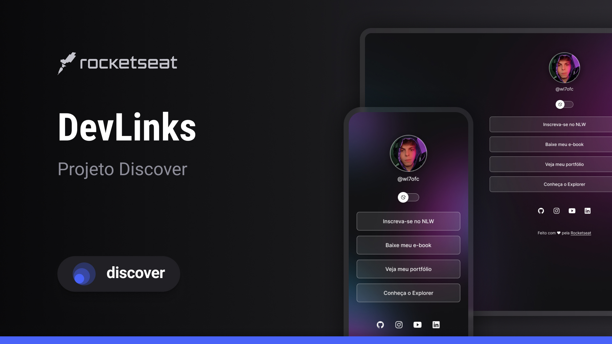

<h1 align="center"> DevLinks </h1>

  

  O **DevLinks** é um projeto desenvolvido pela **Rocketseat** para ser o seu cartão de visitas digital, agregando todos os links importantes em um único lugar.  
  <a href="https://www.rocketseat.com.br/discover" target="_blank"><strong>Estude esse projeto em formato de vídeo clicando aqui.</strong></a>

  <a href="#-tecnologias">Tecnologias</a>&nbsp;&nbsp;&nbsp;|&nbsp;&nbsp;&nbsp;
  <a href="#-projeto">Projeto</a>&nbsp;&nbsp;&nbsp;|&nbsp;&nbsp;&nbsp;
  <a href="#-layout">Layout</a>&nbsp;&nbsp;&nbsp;|&nbsp;&nbsp;&nbsp;
  <a href="#memo-licença">Licença</a>

  

 

  

## 🚀 Tecnologias

Esse projeto foi desenvolvido com as seguintes tecnologias:

- **HTML5** e **CSS3** para estruturar e estilizar o conteúdo da página.
- **JavaScript** para a interação dinâmica, incluindo funcionalidades como alertas e navegação.
- **Git** e **GitHub** para versionamento e controle de código.
- **Figma** para o design e prototipagem do layout.

## 💻 Projeto

O **DevLinks** é um agregador de links super simples e eficiente, que pode ser usado como um cartão de visitas online. Com ele, você pode adicionar seus links mais importantes e compartilhar de maneira prática.

- [Acesse o projeto finalizado, online](https://william77ofc.github.io/projeto/)

- [Assistir aulas sobre o projeto na Rocketseat](https://www.rocketseat.com.br/devlinks)

## 🔖 Layout

O layout foi projetado no **Figma**, uma plataforma de design colaborativo, e você pode visualizá-lo clicando no link abaixo:

- [Visualizar o layout no Figma](https://www.figma.com/community/file/1187422022288947321)

> **Observação**: Para acessar o layout, é necessário ter uma conta no [Figma](https://figma.com).

## :memo: Licença

Esse projeto está sob a licença **MIT**. Veja mais detalhes na [documentação de Licença](https://opensource.org/licenses/MIT).

---

Feito com ♥ pela equipe da **Rocketseat**. 🚀

Se você está interessado em aprender mais sobre desenvolvimento, junte-se à nossa comunidade no [Discord](https://discord.gg/rocketseat)!
